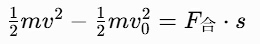
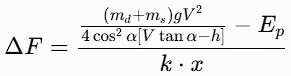

# DartRack Upper 安装部署教程

本项目是一个基于 Qt 6 和 C++17 开发的桌面应用，用于控制一个飞镖发射架。它使用 CMake 进行构建，并依赖 Eigen3 库进行坐标计算。

## 1. 图形化框架和函数库

- **图形与UI框架**: Qt 6 (Core, Gui, Widgets, SerialPort)
- **数学计算库**: Eigen3 (用于线性代数和坐标变换)
- **构建系统**: CMake
- **编译器**: 需要支持 C++17 标准的编译器 (如 MSVC, GCC, Clang)

## 2. 各模块功能（文件目录结构及文件用途说明）

- **`main`**: 应用程序入口。
- **`serial`**: 封装了底层串口通信协议，包括CRC校验和各类控制指令。
- **`1serialConnect`**: 主窗口，管理串口连接，并作为其他功能模块的启动入口。
- **`myComboxBox`**: 自定义下拉框组件，用于刷新串口列表。
- **`2yawAiming`**: 提供对设备进行水平（Yaw轴）精确调整的界面。
- **`3dartsParasComp`**: 根据输入的物理参数（距离、角度等）计算发射所需拉力的界面。
- **`0testDart`**: 用于直接测试和控制预设通道的发射参数。
- **`05testDartByTS`**: 高精度模式下的校准与测试模块，用于建立不同坐标系之间的转换关系。
- **`35dartsParasCompByTS`**: 核心高精度计算模块，利用 `Eigen` 库进行3D坐标变换，实现自动化精确瞄准。

---

## 3. 在 Windows 下的配置教程 (以 Windows 11 为例)

### 步骤 1: 安装所需软件
1.  **Qt 6**:
    - 前往 [Qt 官网下载页面](https://www.qt.io/download-open-source) 下载 Qt Online Installer。
    - 运行安装程序并登录您的 Qt 账户。
    - 在选择组件页面，选择一个 Qt 6 版本 (例如 `Qt 6.6.3`)，并确保勾选以下组件：
        - `MSVC 2019 64-bit` 或更高版本 (与你的 Visual Studio 对应)
        - `Qt 5 Compatibility Module` (可选，但建议勾选以防万一)
        - `Developer and Designer Tools` -> `CMake`

2.  **CMake**:
    - 尽管 Qt 安装器可以安装 CMake，但建议从 [CMake 官网](https://cmake.org/download/) 下载最新版本，以便在命令行中全局使用。
    - 安装时，选择 **"Add CMake to the system PATH for all users"**。

3.  **Eigen3**:
    - 前往 [Eigen 官网](https://eigen.tuxfamily.org/) 下载最新的稳定版 Eigen 库 (例如 3.4.0)。
    - 下载后解压到一个固定的位置，例如 `C:\libs\eigen-3.4.0`。你只需要解压即可，Eigen 是一个纯头文件库，无需编译。

4.  **Git**:
    - 从 [Git 官网](https://git-scm.com/download/win) 下载并安装。

### 步骤 2: 配置环境变量

1.  将 Qt 的 `bin` 目录和编译器的 `bin` 目录添加到系统环境变量 `Path` 中。例如：
    - `C:\Qt\6.6.3\msvc2019_64\bin`
    - `C:\Program Files\Microsoft Visual Studio\2022\Community\VC\Tools\MSVC\14.38.33130\bin\Hostx64\x64` (请根据你的实际路径修改)

### 步骤 3: 克隆并构建项目

1.  打开 Git Bash 或命令提示符，克隆项目：
    ```bash
    git clone <your-repository-url>
    cd dartRack_upper
    ```

2.  创建 `build` 目录并进入：
    ```bash
    mkdir build
    cd build
    ```

3.  使用 CMake 配置项目。你需要告诉 CMake Eigen3 的位置：
    ```bash
    cmake .. -DCMAKE_PREFIX_PATH=C:\Qt\6.6.3\msvc2019_64 -DEIGEN3_INCLUDE_DIR=C:\libs\eigen-3.4.0
    ```
    - `-DCMAKE_PREFIX_PATH`: 指向你的 Qt 安装路径。
    - `-DEIGEN3_INCLUDE_DIR`: 指向你解压的 Eigen 库的路径。

4.  编译项目：
    ```bash
    cmake --build . --config Release
    ```

5.  编译成功后，可执行文件 `dartRack_upper.exe` 会出现在 `build\Release` 目录下。

---

## 4. 在 Linux 下的配置教程 (以 Ubuntu 22.04 LTS 为例)

### 步骤 1: 安装所需软件

1.  打开终端，更新包列表：
    ```bash
    sudo apt update
    ```

2.  安装编译工具、Git 和 CMake：
    ```bash
    sudo apt install build-essential git cmake
    ```

3.  安装 Qt 6 开发库：
    ```bash
    sudo apt install qt6-base-dev qt6-serialport-dev
    ```

4.  安装 Eigen3 开发库：
    ```bash
    sudo apt install libeigen3-dev
    ```
    在 Ubuntu 上，Eigen3 的头文件会自动安装到系统路径 `/usr/include/eigen3/`。

### 步骤 2: 克隆并构建项目

1.  克隆项目：
    ```bash
    git clone <your-repository-url>
    cd dartRack_upper
    ```

2.  创建 `build` 目录并进入：
    ```bash
    mkdir build
    cd build
    ```

3.  使用 CMake 配置项目。由于库都安装在标准路径下，通常不需要额外指定路径：
    ```bash
    cmake ..
    ```
    如果 CMake 找不到 Eigen3，你可以手动指定路径：
    ```bash
    cmake .. -DEIGEN3_INCLUDE_DIR=/usr/include/eigen3
    ```

4.  编译项目：
    ```bash
    make -j$(nproc)
    ```
    或者使用 cmake --build
    ```bash
    cmake --build .
    ```

5.  编译成功后，可执行文件 `dartRack_upper` 会出现在 `build` 目录下。你可以直接运行它：
    ```bash
    ./dartRack_upper
    ```

## 在 Mac 下的配置教程 (以 Ubuntu 22.04 LTS 为例)
### 依赖工具与软件环境
- IDE：Clion
- Qt开发环境 6.9.0
- Eigen 3.4.0
### Mac
#### Clion安装
[参考教程](https://blog.csdn.net/weixin_45571585/article/details/126977413)

#### Clion上配置Qt开发环境
[参考教程](https://blog.csdn.net/weixin_45571585/article/details/127074832)

如果找不到Qtserial模块，需要把Qt Serial Port模块一起安装。
[参考链接](https://zhuanlan.zhihu.com/p/420596587)

# 功能介绍
为了适应场地误差，必须要避免人工调参，因为人工调参依赖人工经验，需要“调参手”通过超过1000发的调参测试来训练，并且人工调参经验难以全部传承给下一届队员。因此，我开发了一个弩控诸元火控系统，主要的硬件是笔记本电脑（windows, linux, mac都可以使用的上位机）和免棱镜全站仪，免棱镜全站仪通过测量基地靶、飞镖发射架导轨上的4个点、飞镖出射点，可以得到精确的飞镖发射架pitch角度、基地靶的高度与水平距离，再结合动能定理、弓片势能计算、斜抛公式、以及提前标定出来的两组与镖架机械相关的数据，可以得出打中基地靶所需的拉力闭环数据。这大概是赛场上唯一一个落地的可以在3分钟准备时间完成参数计算的方案（其实我更喜欢叫它诸元火控或者参数计算，在赛场下做的测试比较适合叫作标定）。
# 使用手册
## 1.首页
 首页是串口连接界面，左侧是与下位机的调试串口（收发），在四发连射时左侧串口需要更改为连接到下位机的裁判系统串口接收口；右侧是与全站仪通信的串口（只收不发），在四发连射时右侧串口需要更改为连接到下位机调试串口（用来接受调试信息，只收不发）。


## 2.飞镖测试界面
点击第0.5步:标定飞镖ByTS，然后会弹出来两个界面，第一个界面是测试飞镖使用的界面，界面中会有一堆文本框：

- **目标拉力值**：指的是拉力闭环的目标值，相关代码：
    ```
    void SetTen(QWidget *parent, QSerialPort *serialPort, int channel, QString tension){
        if(checkSerialOpen(parent, serialPort)){
            QString tensionBuff;
            tensionBuff = "SetTen(" + QString::number(channel) + "," + tension + ")\n";
            serialPort->write(tensionBuff.toLocal8Bit().data());
        }
    }
    ```
    - 数据格式：`"SetTen(5,)\n"`，5指的是第5发飞镖（测试用的编号，需要与比赛的1-4发序号区分开）
        - 上位机发，飞镖架主控收
- **目标yaw角度**：指的是飞镖架yaw轴的目标值，相关代码：
    ```
    void SetYaw(QWidget *parent, QSerialPort *serialPort, int channel, QString yaw){
        if(checkSerialOpen(parent, serialPort)){
            QString yawBuff;
            yawBuff = "SetYaw(" + QString::number(channel) + "," + yaw + ")\n";
            serialPort->write(yawBuff.toLocal8Bit().data());
        }
    }
    ```
    - 数据格式：`"SetYaw(5,)\n"`，5指的是第5发飞镖（测试用的编号，需要与比赛的1-4发序号区分开）
        - 上位机发，飞镖架主控收
- **当前拉力值**：指的是飞镖架主控传回的当前测力计测到的数据
- **当前yaw角度**:指的是飞镖架主控传回的当前自瞄测到的偏差值数据，当前拉力值和当前yaw角度的相关代码:
    ``` 
    if(this->visible && 
    ((receiveBuff.contains("curYaw: ") && receiveBuff.contains("/") ) 
    || (receiveBuff.contains("curTen: ") && receiveBuff.contains(";"))))
    {
    ```

    - 飞镖架主控回传格式（注意空格）:`"curYaw: 100/ \n curTen: -1000;"`当回传的数据与要求的一致时，上位机会自动提取出来放到左下角文本框里。
        - 上位机收，飞镖架主控发
- **发送目标值**：当按钮被点击时，对应的那行的文本框内的目标拉力值与目标yaw角度将会通过串口发送出去，如果**不点击的话，只填写在文本框内，是不会发送的**。
    - 数据格式：`"SetTen(5,)\nSetYaw(5,)\n"`
        - 上位机发，飞镖架主控收
- **发射**：当**发射**按钮被点击时，上位机会向飞镖架主控传输发射字符串。
    - 数据格式：`"TestShoot\n"`
        - 上位机发，飞镖架主控收
- **中止发射**：当**中止发射**按钮被点击时，上位机会向飞镖架主控传输中止发射字符串。
    - 数据格式：`"AbortShoot\n"`
        - 上位机发，飞镖架主控收
        

## 3.标定计算器界面
 点击第0.5步:标定飞镖ByTS弹出来的第二个界面是模型参数反推计算器。


- 第一排是坐标点的三维直角坐标系坐标，默认状态会有一些数据（之前用来测试的）。这个数据来源是**全站仪**，全站仪测完以下6个点后，就可以完成标定了（7-10点是非必须的点，只能用于测量底盘是否水平）
    - 1:目标坐标：这个点是目标落点，如果打基地就是测量基地飞镖靶正中心。
    - 2:导轨左下：这个点是飞镖架发射导轨左侧铝方的下端反光片点。
    - 3:导轨右下：这个点是飞镖架发射导轨右侧铝方的下端反光片点。
    - 4:导轨左上：这个点是飞镖架发射导轨左侧铝方的上端反光片点。
    - 5:导轨右上：这个点是飞镖架发射导轨右侧铝方的上端反光片点。
    - 6:飞镖发射点：这个点是飞镖出射点，可以近似为滑台位于平衡状态时，放上飞镖后的镖头中心点。
    
- 测试完后，将全站仪数据通过RS232转USB线连接到电脑后，将数据传回电脑，具体传输方式每个全站仪的交互都不一样，需要问卖家或者看使用手册。
    - 我们使用的是**科维TKS-302R**，这个在闲鱼上的最低二手价在1k5到2k左右，比mid-360还便宜（。这个全站仪在无棱镜模式下，可以测到250m远（但是如果是黑色物体的话，在25m远就可能测不太到了，所以测基地飞镖靶的时候，需要瞄准白色的基地贴纸）
     

        - 科维TKS-302R的数据格式有两种：
            - 第一种是直角坐标系（分度值1mm，精度3mm）
            ```
            1,1.9620,-1.0600,0.7810,-
            2,-0.4040,-11.0930,1.3620,-
            3,-0.2840,-11.1210,0.7210,-
            4,-0.6890,-11.1550,0.6470,-
            5,-0.8120,-11.1280,1.2910,-
            6,0.7610,-6.1940,1.0810,-
            7,0.8210,-6.2180,0.7520,-
            8,0.6280,-6.1710,0.7150,-
            9,0.5670,-6.1470,1.0470,-
            ```
            表示的意义（以第一排为例）：`1(点号),1.9620(x坐标 单位米),-1.0600(y坐标 单位米),0.7810(z坐标 单位米),-(编号 在全站仪上填，用-符号方便处理字符串)`
            - 第二种是球坐标系（这个精度更高，角度分度值是3角秒，合约0.00083度；测距分度值1mm，精度3mm）
            ```
            JOB     1666,
            INST    TKS-300R Ver.1.10C
            
            UNITS   M,D
            SS      16,0.000,-
            SD      257.3604,107.0035,2.645
            SS      17,0.000,-
            SD      267.3948,126.4424,2.225
            SS      18,0.000,-
            SD      263.5537,117.2943,2.890            
            SS      19,0.000,-
            SD      251.4223,117.4135,2.871
            SS      20,0.000,-
            SD      255.3924,119.5437,2.260
            SS      21,0.000,-
            SD      256.4905,120.0247,2.258
            SS      22,0.000,-
            SD      258.4511,107.0903,2.641
            SS      23,0.000,-
            SD      257.5103,107.0411,2.643            
            SS      24,0.000,-
            SD      255.4824,119.5500,2.260
            SS      25,0.000,-
            SD      256.5808,120.0220,2.257
            SS      26,0.000,-
            SD      258.4246,107.0750,2.641
            ```     

            以第一组数据为例：
            `SS      16(点号),0.000,-(编号 在全站仪上填，用-符号方便处理字符串)`
            `257（YAW，度）.36（YAW，分）04（YAW，秒）,107（PITCH（与正z轴的角度），度）.00（PITCH，分）35（PITCH，秒）,2.645（测距得到的斜距，米）`
- 数据导完后，上位机会自动转换为三维直角坐标（如果坐标没刷新的话，说明格式不一致）。点击**计算p,r,θ,x,h**按钮，会计算出底盘pitch角（抬头为正），底盘roll角（向右滚转为正），当前发射轨道pitch角少：当前发射轨道yaw角（向右转为正），发射点到目标的水平距离，发射点到目标的竖直距离。
- 然后将发射台质量（克）填入到**m发射台(g)** 中
- 将飞镖质量（克）填入到**m发射台(g)** 中
- 点击**计算 ∫F₀·dx拉(F5)**，这样便可以测到弹道模型的第一个参数 **∫F₀·dx拉**以及对应的落点在这里的时候目标拉力值**F₀**，**∫F₀·dx拉**参数可以理解为与初始拉力相关，越大代表势能越大。但是实际上这个参数是把阻力刨掉了的，以**飞镖初始动能**命名更准确。
**注意：** 最好确定飞镖能稳定命中该点后，再进行标定该参数，最好让后面的测试次数尽量少，避免多次测试导致的疲劳衰减。标定好参数后直接上场再自动计算一遍参数就行。
- 然后需要加一点点力，让飞镖落点与原来的偏差有20-100cm，然后再次标定出另外一个参数**k1·x拉**，并且记住当前的目标拉力值**起始的 T总 = F₀ + ΔT测**，这个参数与劲度系数相关。
**注意：** 这两次测试都需要尽量让两个点与基地靶的位置设置相距较近，模型是线性拟合非线性的，如果与实际距离过远，会因为非线性问题导致误差积累过大而无法命中。
- 再测出6个点，导入上位机，点击**计算p,r,θ,x,h**按钮。点击**复制 ∫F₀·dx拉(F6)**，将目标拉力值**F₀**填到**自己设置的F₀**文本框里，将**起始的 T总 = F₀ + ΔT测**填入文本中，再点击**计算 k1·x拉(F7)**，就可以计算出**k1·x拉**参数。
## 4.yaw瞄准界面
 从首页点击**第2步:yaw轴瞄准(F2)** 后，会弹出一个界面

在这个页面可以使用键盘来对yaw轴进行不同幅度的移动。
注：不推荐长按，每秒的按键输出速度太快，会导致松手后还没把数据发完。并且发太久后会有bug，发不出串口，重新插拔下上位机到飞镖架主控的usb线就行。
    - 数据格式：`"SetYaw(" + QString::number(channel) + "," + yaw + ")\nSetCurYawToZero\n"`
        - 上位机发，飞镖架主控收
- **当前yaw移动总脉冲** 是上位机自己计算的该页面移动过的脉冲的合（含正负），不需要飞镖架主控回传数据。
- 其他按钮是24赛季的时候使用的，也没必要删，就留着了（
## 5.飞镖参数计算系统界面详解

从首页点击**第3.5步:飞镖参数计算ByTS(F4)**，会弹出一个4发连射参数计算界面。

这个界面是用来计算飞镖打到对应落点的目标拉力计算系统，可以根据之前测出来的**F₀**（**F₀镖1**）、**∫F₀·dx拉**（**∫F₀·dx拉+W镖1阻力**）、**k₁·x拉**(四个镖使用同一个**k₁·x拉**参数）参数和其他可以测量出的参数来计算出目标拉力。

这个界面是整个飞镖系统的核心控制中心，通过精确的物理计算和参数配置，确保飞镖能够准确命中目标位置。

   
### 1) 坐标数据显示区
界面顶部显示各测量点的三维直角坐标系坐标，数据来源为**全站仪**测量结果：

- **1:目标坐标**：目标落点，打击基地时即为基地飞镖靶正中心
- **2:导轨左下**：飞镖架发射导轨左侧铝方下端反光片点
- **3:导轨右下**：飞镖架发射导轨右侧铝方下端反光片点  
- **4:导轨左上**：飞镖架发射导轨左侧铝方上端反光片点
- **5:导轨右上**：飞镖架发射导轨右侧铝方上端反光片点
- **6:飞镖发射点**：滑台平衡状态下，装上飞镖后的镖头中心点
- **12-15:参考点**：用于坐标系转换的参考点（25赛季区域赛发现不需要后就不再使用）

### 2) 核心参数计算区
基于物理公式进行计算：
**ΔT测·k₁·x拉 = (m镖 + m发射台)·g·x² / { 4·cos²(θ)·[x·tan(θ) - h] } - ∫F₀·dx拉**

计算流程分为三步：
1. 测量(m镖·g)、L和β，计算得到x和h
2. T测拉到F₀，发射后计算出∫F₀·dx拉
3. ΔT测变化，发射后计算出k₁·x拉

### 3) 飞镖参数配置区
支持同时配置4发飞镖的参数，每发包含：

- **F₀**：基础张力值
- **m镖(g)**：飞镖质量（克）
- **Δψ镖(弧度)**：偏航角偏差（左正右负）
- **∫F₀·dx拉 + W镖阻力**：阻力积分项
- **镖h修正偏差(cm)**：高度修正值（往上修正为正），一般用在局间调试，通过观察落点偏差进行微调

### 4) 操作执行区
提供一系列操作按钮：

- **计算x和h(F4)**：计算水平距离和高度差
- **计算T总(a/s/d/f)**：分别计算各飞镖的总张力
- **计算T总1234(F5)**：批量计算所有飞镖张力
- **发送第x发参数**：将参数发送到飞镖系统
- **发送第一二三四发参数(F7)**：批量发送所有参数
- **发射**/**中止发射**：执行或取消发射指令

### 5) 一次建站法测绘
#### 两次建站法测绘步骤
1. 在场下通过标定计算器反推4个**F₀**（**F₀镖1**）参数、4个**∫F₀·dx拉**（**∫F₀·dx拉+W镖1阻力**）参数、1个**k₁·x拉**(四个镖使用同一个**k₁·x拉**参数）参数。
2. 在3分钟准备时间时，使用全站仪在赛场入口后方测量**点1,2,3,4,5,6**。
3. 将全站仪连接首页右侧串口。
4. 将全站仪数据传输到电脑上位机(需要提前打开参数计算界面，并输入所有提前测量好的参数)上。
5. 使用参数计算界面计算拉力闭环值。
6. 拿着电脑跑到飞镖发射井。
7. 将飞镖架主控调试串口连接到首页左侧串口。
8. 将目标拉力值和yaw轴偏差值传输到飞镖架主控板中。
9. 前往观赛区等待飞镖命中。


### 6) 两次建站法测绘
两次建站法是另外一个测量方法（区域赛前期有用过，但是发现可以在3分钟准备时就看到基地飞镖靶后，就没有再使用过了），为了防止3分钟准备阶段看不到基地飞镖靶的话，需要在能看到基地靶的地方测量**1:目标坐标**，然后挑选合适的两个点粘贴反光片，作为**12:参考点1坐标系1**和**13:参考点2坐标系1**，这两个点需要满足的要求是
- 需要在建站点1（坐标系1）能测量到**1:目标坐标**，能测量到参考点1和参考点2作为**12:参考点1坐标系1**和**13:参考点2坐标系1**
- 在3分钟准备阶段，也能测量到参考点1和参考点2作为**13:参考点1坐标系2**和**14:参考点2坐标系2**
        
因此，这两个参考点是需要仔细选择的。但是25赛季的赛场背后能同时测量到基地飞镖靶和飞镖架导轨，所以是不需要使用参考点的。
#### 两次建站法测绘步骤
1. 在场下通过标定计算器反推4个**F₀**（**F₀镖1**）参数、4个**∫F₀·dx拉**（**∫F₀·dx拉+W镖1阻力**）参数、1个**k₁·x拉**(四个镖使用同一个**k₁·x拉**参数）参数。
2. 在3分钟准备时间**前**使用全站仪测量**1:目标坐标**，然后挑选合适的两个点粘贴反光片，作为**12:参考点1坐标系1**和**13:参考点2坐标系1**。
3. 在3分钟准备时间时，使用全站仪在赛场入口后方测量**点1,2,3,4,5,6**。
4. 将全站仪连接首页右侧串口。
5. 将全站仪数据传输到电脑上位机(需要提前打开参数计算界面，并输入所有提前测量好的参数)上。
6. 使用参数计算界面计算拉力闭环值。
7. 拿着电脑跑到飞镖发射井。
8. 将飞镖架主控调试串口连接到首页左侧串口。
9. 将目标拉力值和yaw轴偏差值传输到飞镖架主控板中。
10. 前往观赛区等待飞镖命中。

## 模拟裁判系统串口进行四发连射
由于软件bug，无法使用首页右侧的串口来发数据，因此，测试步骤是这样的：

1. 在场下通过标定计算器反推4个**F₀**（**F₀镖1**）参数、4个**∫F₀·dx拉**（**∫F₀·dx拉+W镖1阻力**）参数、1个**k₁·x拉**(四个镖使用同一个**k₁·x拉**参数）参数。
2. 在场下使用全站仪在飞镖架后方测量**点1,2,3,4,5,6**。
3. 将全站仪连接首页右侧串口。
4. 将全站仪数据传输到电脑上位机(需要提前打开参数计算界面，并输入所有提前测量好的参数)上。
5. 使用参数计算界面计算拉力闭环值。
6. 将飞镖架主控调试串口连接到首页左侧串口。
7. 将目标拉力值和yaw轴偏差值传输到飞镖架主控板中。
8. 将首页左侧串口和右侧串口断开，将上位机左侧串口通过USB转串口模块连接到飞镖架主控板的裁判系统通信串口（记得调整波特率为115200），将上位机右侧串口连接到飞镖架主控板的调试串口（用来看数据，记得调整波特率）。
9. 点击**发射**按钮，会模拟一次飞镖闸门从开启到关闭的串口数据（但是没有其他的数据，所以数据量会比较少，所以场下能发射不能保证场上一定能发射，还需要调整串口缓冲区大小）。
10. 等待发射完毕并关闭闸门（7秒）。
11. 再次点击**发射**按钮。
12. 捡镖装填再打。


# 软件效果展示
## 视频展示
[B站视频](https://www.bilibili.com/video/BV1rH4y1G72N)

测量基地飞镖靶展示

## 标定数据结果表格


# 软件与硬件的系统框图、数据流图


*图示：软件架构*


*图示：硬件架构*


*系统时序图*


*参数反推/标定计算器时序图*

# 原理介绍与理论支持分析
当首次测试发射后，需要使用全站仪进行实际落点的坐标测量，以及飞镖发射架的发射导轨的4个角点和导轨上的飞镖发射点（当飞镖放上滑台后，滑台不在上膛状态时，此时的飞镖正前方的中心点）。

通过全站仪测好点后，通过RS232转USB，将6个点的球坐标数据传给在MacBook上的QT上位机。QT上位机自动将6个球坐标点转换为直角坐标系的点，直角坐标 (x, y, z) 与球坐标 (r, θ, φ) 的转换公式为：
x = r * sin(θ) * cos(φ)
y = r * sin(θ) * sin(φ)
z = r * cos(θ)

QT上位机通过这6个点自动计算出发射导轨的俯仰角α、飞镖发射点到实际落点的垂直距离H、飞镖发射点到实际落点的水平距离V。


由动能定理：
，即

再由斜抛定理：

可推得飞镖发射的动能：

但是由于飞镖和滑台是一起运动的，滑台的重量不能忽略，要计算总弹性势能的话，需要加入滑台的动能损耗：

可得：
**（势能参数反推公式）**，其中md是飞镖质量，ms是滑台质量
将弓片简化为线性系统（需要在一个小范围内才可认为是线性）：
并使用同样的测试方法，提升拉力后再发射，测量坐标，联立方程，
进行计算后可得：
**（劲度系数参数反推公式）**

当参数反推完成后，便可以通过计算出来的参数进行指哪打哪的拉力闭环计算了。
公式为：
，计算结果再带入
，其中F0为反推弹性势能参数时使用的发射拉力，ΔF是反推劲度系数*蓄力距离参数时相比于F0增加的拉力值。

# 软件架构或层级图

# 未来优化方向
- 加入数据记忆功能
- 适配其他全站仪的数据格式
- 修复一些bug（特性）：比如首页右侧串口不能发只能收，然后右侧串口接收了飞镖架主控的数据后，会导致被参数计算界面误识别成全站仪数据。

# 开源协议
GPL 3.0